Caso práctico final
================

# Descripción corta del challenge

Partiendo de un dataset de Kaggle, se realiza un análisis exploratorio
de datos utilizando diferentes visualizaciones y técnicas estadísticas,
se extraen conclusiones interesantes. Se seleccionan variables, se
construye un modelo de regresión lineal, y se analizan las predicciones
del modelo.

# Contexto

Ha de escogerse una BBDD para realizar una exploración estadística
propia de un científico de datos. Seguir los siguientes pasos para
desarrollar el proyecto:

-   Extracción de los datos / origen de los datos (habitualmente csv)
-   EDA
-   Inferencia estadística
-   Pre-procesado de datos, si tras aplicar los test hacemos alguna
    modificación de las columnas.
-   Selección de variables.
-   Modelos lineales.
-   Interpretación de resultados / conclusiones.

# Dataset elegido

He escogido un dataset de Kaggle “Medical Cost Personal Datasets”
(<https://www.kaggle.com/mirichoi0218/insurance?select=insurance.csv>),
sugerido por un website
(<https://www.telusinternational.com/articles/10-open-datasets-for-linear-regression>)
cuando googleé datasets interesantes sobre los que implementar
algoritmos de regresión lineal. La variable target es numérica, por lo
que utilizaremos regresión lineal.

Utilizando la información de este dataset, trataremos de predecir el
coste de la prima del seguro médico, basándonos en una serie de
características recopiladas sobre personas que tienen contratado un
seguro (en USA).

Las variables (7) recogidas en este dataset son las siguientes:

-   age: edad del asegurado
-   sex: género del asegurado
-   bmi: índice de masa corporal. Se calcula dividiendo el peso de una
    persona (kg.) por su altura (m.) al cuadrado. Los valores normales
    suelen estar entre 18.5 y 25, valores fuera de ese intervalo pueden
    ser indicadores de excesiva delgadez o sobrepeso.
-   children: cito la explicación en la web donde encontré el dataset:
    “Number of children covered by health insurance / Number of
    dependents”. Parece que los hijos/dependientes que no estén
    asegurados no se tienen en cuenta, no queda claro qué pasa si tienes
    hijos y también tienes personas dependientes (supongo que deberían
    sumarse)… De todas formas, a efectos de este estudio, puede que no
    haga falta profundizar en el significado de esta variable.
-   smoker: es fumador o no
-   region: dónde reside el asegurado
-   charges (TARGET): Prima del seguro en dólares. Variable numérica.

# Solución

## Carga de paquetes

``` r
library(dplyr)
```

    ## Warning: package 'dplyr' was built under R version 4.1.1

    ## 
    ## Attaching package: 'dplyr'

    ## The following objects are masked from 'package:stats':
    ## 
    ##     filter, lag

    ## The following objects are masked from 'package:base':
    ## 
    ##     intersect, setdiff, setequal, union

``` r
library(ggplot2)
```

    ## Warning: package 'ggplot2' was built under R version 4.1.1

``` r
library(MASS)
```

    ## Warning: package 'MASS' was built under R version 4.1.1

    ## 
    ## Attaching package: 'MASS'

    ## The following object is masked from 'package:dplyr':
    ## 
    ##     select

## 1.Extracción de los datos

``` r
df <- read.csv("insurance.csv", sep=",", header = T)
```

``` r
head(df)
```

    ##   age    sex    bmi children smoker    region   charges
    ## 1  19 female 27.900        0    yes southwest 16884.924
    ## 2  18   male 33.770        1     no southeast  1725.552
    ## 3  28   male 33.000        3     no southeast  4449.462
    ## 4  33   male 22.705        0     no northwest 21984.471
    ## 5  32   male 28.880        0     no northwest  3866.855
    ## 6  31 female 25.740        0     no southeast  3756.622

## 2. EDA

### Exploración preliminar

Obtenemos información muy superficial sobre los datos en su conjunto

``` r
nrow(df)
```

    ## [1] 1338

``` r
ncol(df)
```

    ## [1] 7

``` r
str(df)
```

    ## 'data.frame':    1338 obs. of  7 variables:
    ##  $ age     : int  19 18 28 33 32 31 46 37 37 60 ...
    ##  $ sex     : chr  "female" "male" "male" "male" ...
    ##  $ bmi     : num  27.9 33.8 33 22.7 28.9 ...
    ##  $ children: int  0 1 3 0 0 0 1 3 2 0 ...
    ##  $ smoker  : chr  "yes" "no" "no" "no" ...
    ##  $ region  : chr  "southwest" "southeast" "southeast" "northwest" ...
    ##  $ charges : num  16885 1726 4449 21984 3867 ...

``` r
summary(df)
```

    ##       age            sex                 bmi           children    
    ##  Min.   :18.00   Length:1338        Min.   :15.96   Min.   :0.000  
    ##  1st Qu.:27.00   Class :character   1st Qu.:26.30   1st Qu.:0.000  
    ##  Median :39.00   Mode  :character   Median :30.40   Median :1.000  
    ##  Mean   :39.21                      Mean   :30.66   Mean   :1.095  
    ##  3rd Qu.:51.00                      3rd Qu.:34.69   3rd Qu.:2.000  
    ##  Max.   :64.00                      Max.   :53.13   Max.   :5.000  
    ##     smoker             region             charges     
    ##  Length:1338        Length:1338        Min.   : 1122  
    ##  Class :character   Class :character   1st Qu.: 4740  
    ##  Mode  :character   Mode  :character   Median : 9382  
    ##                                        Mean   :13270  
    ##                                        3rd Qu.:16640  
    ##                                        Max.   :63770

Vamos a revisar el número de valores diferentes que tenemos para las
variables de tipo character. Si tienen pocos valores, son buenas
candidatas a ser reconvertidas a variables factor.

``` r
df %>% select_if(is.character) %>% sapply(unique) 
```

    ## $sex
    ## [1] "female" "male"  
    ## 
    ## $smoker
    ## [1] "yes" "no" 
    ## 
    ## $region
    ## [1] "southwest" "southeast" "northwest" "northeast"

``` r
# Transformamos estas 3 variables a tipo factor, en este caso no ordenados
df$sex <- as.factor(df$sex)
df$smoker <- as.factor(df$smoker)
df$region <- as.factor(df$region)
```

Repetimos summary para checkear los valores para cada nivel en las
variables factor

``` r
df %>% select_if(is.factor) %>% summary
```

    ##      sex      smoker           region   
    ##  female:662   no :1064   northeast:324  
    ##  male  :676   yes: 274   northwest:325  
    ##                          southeast:364  
    ##                          southwest:325

``` r
# Buscamos valores nulos en el dataframe
sapply(df, function(x) sum(is.na(x)))
```

    ##      age      sex      bmi children   smoker   region  charges 
    ##        0        0        0        0        0        0        0

``` r
# Buscamos duplicados
sum(duplicated(df))
```

    ## [1] 1

``` r
# Tenemos un duplicado. Examinarlo más en detalle
df %>% dplyr::filter(duplicated(df) | duplicated(df, fromLast = TRUE))
```

    ##   age  sex   bmi children smoker    region  charges
    ## 1  19 male 30.59        0     no northwest 1639.563
    ## 2  19 male 30.59        0     no northwest 1639.563

``` r
# Es bastante coincidencia para no considerarlo un duplicado, pero tampoco podemos estar 100% seguros de que lo sea. Como sólo es un valor, simplemente lo vamos a dejar estar
```

### Análisis univariable

Utilizamos un bucle para representar gráficamente cómo está distribuida
cada una de las variables. Para cada tipo de variable (factor, numérica)
del dataframe usaremos un gráfico diferente

``` r
for (columna in 1:ncol(df)){
  if (class(df[,columna]) == "factor"){
    # Gráfico de barras para las variables factor.
    plot(df[,columna], 
         col = topo.colors(length(levels(df[,columna]))),
         las = 1,
         main = paste("Diagrama de barras de: ", colnames(df[columna])))
  } else {
    # Histograma para las variables numéricas.
    hist(df[, columna], 
         border = "blue", 
         col = "tomato", 
         las = 1, 
         main = paste("Histograma de: ", colnames(df[columna])),
         xlab  = colnames(df[columna]))
  }
}
```

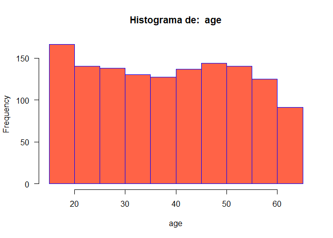<!-- -->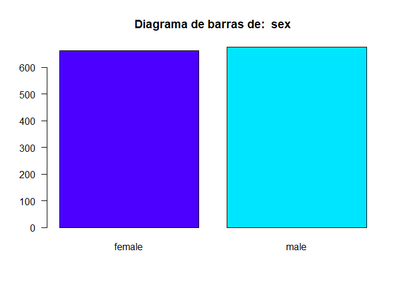<!-- -->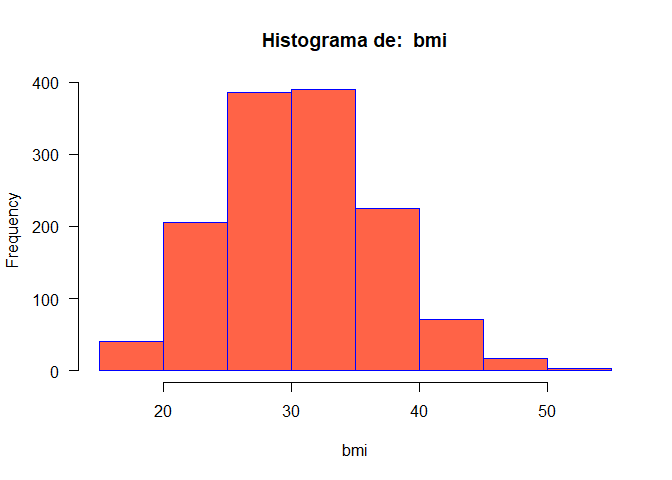<!-- -->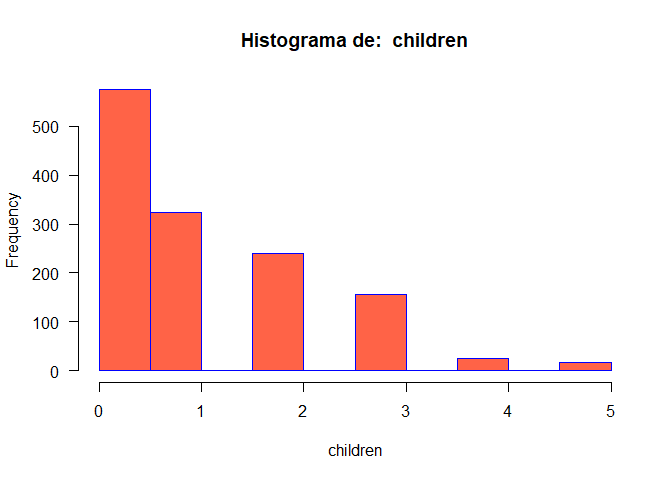<!-- -->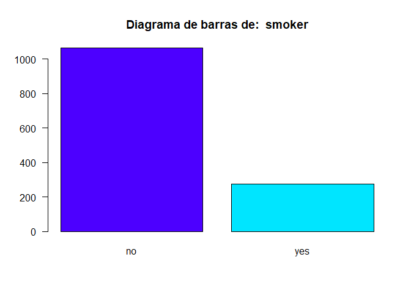<!-- -->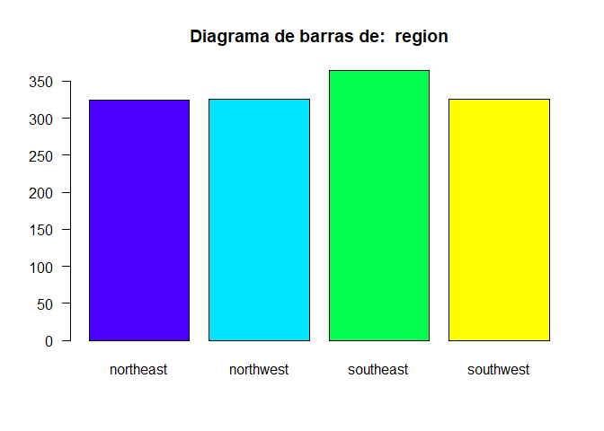<!-- --><!-- -->

**Observaciones**

-   Age:

Curioso que la edad mínima sea 18, y que el intervalo de edad con mayor
frecuencia sea precisamente los menores de 20 años. Lo vamos a examinar
más en profundidad.

``` r
# de forma numérica
df %>% dplyr::select (age) %>% filter(age < 25) %>% table
```

    ## .
    ## 18 19 20 21 22 23 24 
    ## 69 68 29 28 28 28 28

``` r
# muy llamativo. En la siguiente etapa (análisis multivariable) seguiremos indagando y tomaremos una decisión acerca de qué hacer con estos valores
```

-   Sex:

Nada llamativo.

-   bmi:

Distribución bastante similar a la distribución normal, simétrica y con
forma de campana, lo cual parece plausible para una variable como el
bmi. La mediana está en valores muy altos, si bien USA es un país donde
es bastante corriente el sobrepeso. LLaman la atención valores
superiores a 40, obesidad de clase 3 o high risk obesity según
<https://medlineplus.gov/ency/patientinstructions/000348.htm>

Qué porcentaje de nuestro dataset tienen obesidad de clase 3?

``` r
nrow(subset(df, bmi > 40))/nrow(df)*100
```

    ## [1] 6.801196

<https://www.cdc.gov/obesity/data/adult.html>: From 1999 –2000 through
2017 –2018, US obesity prevalence increased from 30.5% to 42.4%. During
the same time, the prevalence of severe obesity increased from 4.7% to
9.2%. (NOTA: severe obesity es la obesidad que antes denominamos “clase
3”).

Para hacer estudios más en profundidad, habría que recabar información
acerca de la fecha en la que fueron recopilados los datos, si tuviésemos
el dato de obesidad de clase 3 de USA incluso podríamos valorar obtener
el intervalo de confianza de la proporción de nuestra muestra para ver
si incluye al dato que encontrásemos (teniendo en cuenta que dicho dato
no es la realidad, también procede de un muestreo!)… Para los propósitos
de este ejercicio, creo que con la información del párrafo anterior es
suficiente para asumir que este porcentaje de obesidad clase 3 de
nuestro dataset es plausible.

-   children: En cuanto a la distribución de valores, nada anómalo en
    principio. Lo que vamos a hacer es transformar esta variable a tipo
    factor con 3 niveles: sin hijos, 1-3 hijos, 4+ hijos.

``` r
df$children <- cut(df$children, breaks = c(-0.5,0.5,3.5,5.5), labels=c("No_children","1-3_children", "4+_children"))
```

-   smoker:

Mayoría de no fumadores

-   region:

Bastante equidistribuidas

-   (TARGET) charges:

recordamos:

``` r
summary(df$charges)
```

    ##    Min. 1st Qu.  Median    Mean 3rd Qu.    Max. 
    ##    1122    4740    9382   13270   16640   63770

A la vista del histograma y del summary, se ve que la tendencia es que
cuanto mayor es la cuota, menos personas encontramos en nuestra muestra,
siendo los valores máximos para los intervalos de frecuencia más
cercanos al 0. También llama la atención que hay valores muy altos.
Vamos a investigar más en profundidad los valores extremos de nuestra
distribución:

Para los valores más bajos: es curioso que el intervalo de frecuencia
máxima en nuestro histograma de charges sea el \[0,5000\], con una
frecuencia muy similar a la del siguiente intervalo \[5000,10000\].
Puede ser perfectamente plausible, pero vamos a visualizar en un gráfico
más en detalle estos datos.

``` r
ggplot (df[df$charges < 15000, ]) +
  geom_density(aes(x=charges))
```

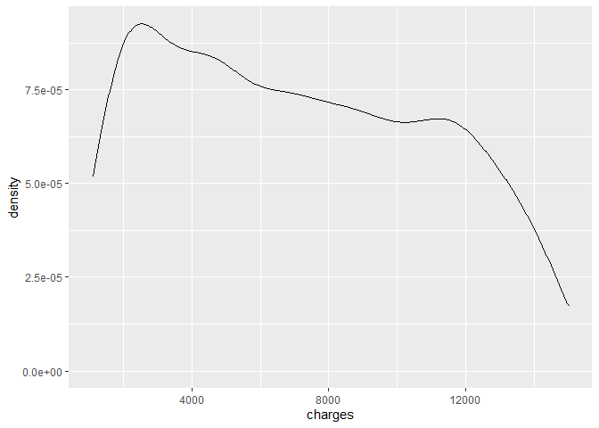<!-- -->

``` r
# A priori, es una distribución plausible, hay una tarifa mínima, tenemos la frecuencia máxima entorno a 2500 dólares, y luego comienza a descender
```

Para los valores más altos:

``` r
df %>% filter(charges > 50000) %>% summary
```

    ##       age            sex         bmi                children smoker 
    ##  Min.   :28.00   female:3   Min.   :30.36   No_children :4   no :0  
    ##  1st Qu.:32.00   male  :4   1st Qu.:33.64   1-3_children:3   yes:7  
    ##  Median :45.00              Median :35.53   4+_children :0          
    ##  Mean   :43.29              Mean   :36.44                           
    ##  3rd Qu.:53.00              3rd Qu.:37.25                           
    ##  Max.   :60.00              Max.   :47.41                           
    ##        region     charges     
    ##  northeast:1   Min.   :51195  
    ##  northwest:2   1st Qu.:53863  
    ##  southeast:2   Median :58571  
    ##  southwest:2   Mean   :57697  
    ##                3rd Qu.:61307  
    ##                Max.   :63770

``` r
# 7 casos, nada excesivamente revelador, bmi más alto que la media, todos son fumadores. Continuamos investigando más adelante.
```

**Primeras conclusiones**

-   Outliers en la variable target. Pueden tener una influencia excesiva
    en el tipo de modelo que usaremos
-   Cantidad de observaciones de menores de 20 años anómalamente alta.
    Se seguirá indagando

### Análisis bivariable (vs TARGET, y entre variables independientes numéricas)

Definimos nuevamente un bucle para representar todas las variables
independientes respecto a la variable de respuesta, de nuevo eligiendo
el gráfico más adecuado para cada tipo de datos

``` r
explain.target <- function(dataframe.object, target.feature){
  
  for (columna in 1:ncol(dataframe.object)){
    
    if (names(dataframe.object[columna]) == "charges"){
      next
      
    } else {
      if (class(dataframe.object[, columna]) == "factor"){
        plot <- ggplot(dataframe.object) + 
          geom_boxplot(aes(x = dataframe.object[, "charges"], fill = as.factor(dataframe.object[, columna]))) +
          coord_flip() +
          labs(title=paste(names(dataframe.object[columna]), " ~ charges"),
               fill= names(dataframe.object[columna]) ) + 
          xlab("charges")
      
      } else {
        plot <- ggplot(dataframe.object) + 
          geom_point(aes(x = dataframe.object[, columna], y = dataframe.object[, "charges"])) + 
          labs(title=paste(names(dataframe.object[columna]), " ~ charges")) + 
          xlab(names(dataframe.object[columna])) +
          ylab("charges")
      }
      plot <- print(plot)
    }
  }
}

explain.target(dataframe.object = df, target.feature = df$charges)
```

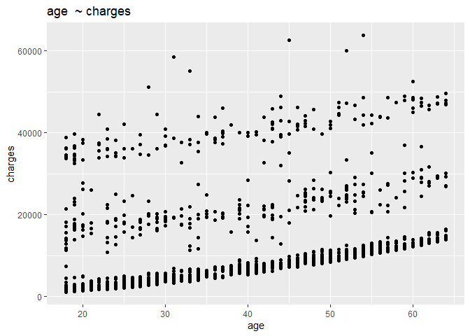<!-- -->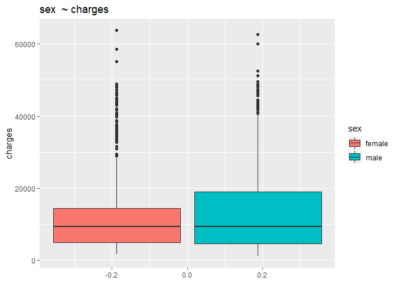<!-- -->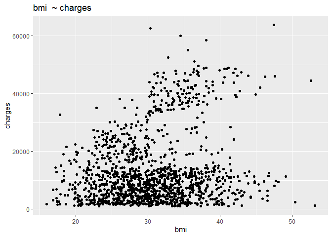<!-- -->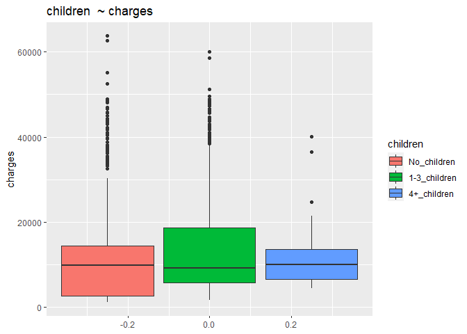<!-- -->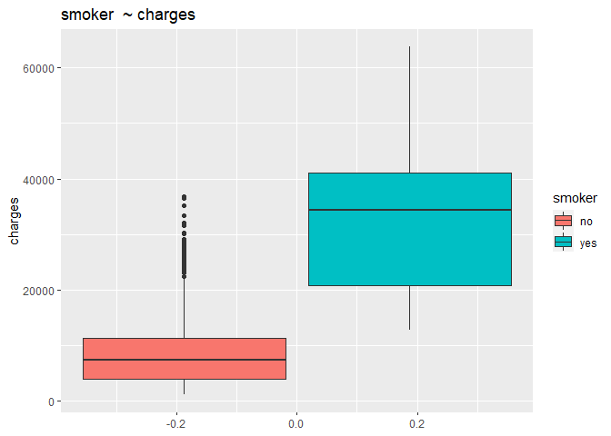<!-- -->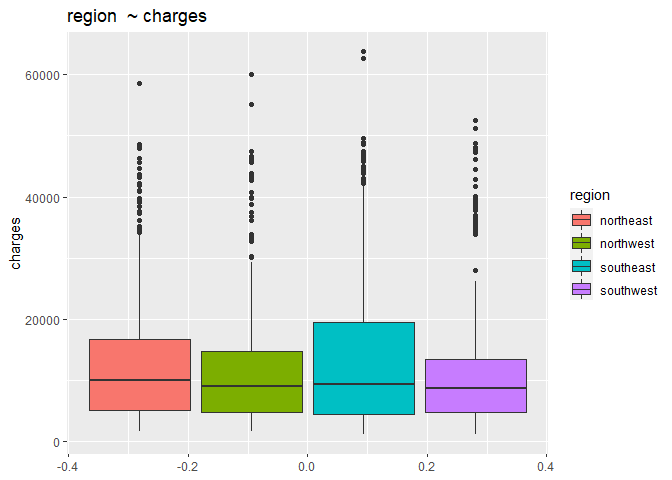<!-- -->
Para las dos variables independientes numéricas, calculamos el
coeficiente de correlación para descartar posibles problemas de
multicolinealidad

``` r
cor.test(df$age,df$charges, method = "pearson")
```

    ## 
    ##  Pearson's product-moment correlation
    ## 
    ## data:  df$age and df$charges
    ## t = 11.453, df = 1336, p-value < 2.2e-16
    ## alternative hypothesis: true correlation is not equal to 0
    ## 95 percent confidence interval:
    ##  0.2494139 0.3470381
    ## sample estimates:
    ##       cor 
    ## 0.2990082

``` r
# correlación estadísticamente significativa, con un valor entorno a +0.3. No debería de suponernos un problema a nivel de multicolinealidad.
```

**Observaciones**

-   sex, children, region, smoker (las variables categóricas):

Parece que, de todas ellas, la única que muestra relación de dependencia
con la variable target es smoker. Y esa relación es clara

En este caso, no podemos utilizar una prueba como anova, porque como
vemos en los boxplots cada factor muestra una dispersión diferente y no
se van a cumplir algunos de los supuestos necesarios para el test ANOVA:
distribución normal y varianza constante (homocedasticidad) dentro de
cada uno de los grupos

-   age:

Gráfica muy interesante, por dos aspectos distintos

En primer lugar, se ve que existe una relación lineal entre age y
charges, siendo directamente proporcionales. Vamos a tratar de
cuantificar esta relación

``` r
regresion_age <- lm(charges ~ age, data=df)
summary(regresion_age)
```

    ## 
    ## Call:
    ## lm(formula = charges ~ age, data = df)
    ## 
    ## Residuals:
    ##    Min     1Q Median     3Q    Max 
    ##  -8059  -6671  -5939   5440  47829 
    ## 
    ## Coefficients:
    ##             Estimate Std. Error t value Pr(>|t|)    
    ## (Intercept)   3165.9      937.1   3.378 0.000751 ***
    ## age            257.7       22.5  11.453  < 2e-16 ***
    ## ---
    ## Signif. codes:  0 '***' 0.001 '**' 0.01 '*' 0.05 '.' 0.1 ' ' 1
    ## 
    ## Residual standard error: 11560 on 1336 degrees of freedom
    ## Multiple R-squared:  0.08941,    Adjusted R-squared:  0.08872 
    ## F-statistic: 131.2 on 1 and 1336 DF,  p-value: < 2.2e-16

``` r
# hay una relación estadísticamente significativa, y lineal entre age y charges (los p valores de los contrastes de hipótesis usados para el coeficiente alfa, coeficiente beta, test de Fisher, son todos ínfimos). Ahora bien, el coeficiente r^2 nos muestra que no es una correlación fuerte: cuando analizamos el conjunto de datos, la variabilidad no explicada por ages es muy superior en relación a la variabilidad explicada por ages. Lo cual concuerda bastante con las impresiones que se observan a simple vista del scatterplot anterior

# Del valor del coeficiente beta, deducimos que por cada 10 años que pasan, la prima de seguro sube unos 2577 dólares
```

En segundo lugar, más allá de esa relación lineal que hemos visto que
existe entre age y charges, es muy interesante la forma en que se
dispersan los valores en el gráfico. Parece como si se distribuyesen en
tres grupos, todos ellos teniendo una relación lineal respecto a age y
además con una pendiente (coeficiente beta) similar.

Es decir, puede que dentro de nuestros datos tengamos una variable (o
combinación de variables) de tipo categórico que nos clasifica los
valores de charges en 3 grupos distintos, bien distinguibles los unos de
los otros.

Vamos a intentar a través del EDA de encontrar esos factores que nos
ayuden a explicar la variabilidad que por ahora no hemos podido
explicar. Para ello, partiendo de la base del scatterplot anterior,
vamos a mostrar los puntos de un color diferente dependiendo de los
niveles del resto de variables categóricas:

``` r
explain.target2 <- function(dataframe.object){
  
  for (columna in 1:ncol(dataframe.object)){

    if (names(dataframe.object[columna]) == "age" | names(dataframe.object[columna]) == "charges"){
    next
    
    } else {    
      if (class(dataframe.object[, columna]) == "factor"){
        plot <- ggplot(dataframe.object) + 
          geom_point(aes(x = dataframe.object[, "age"], y = dataframe.object[, "charges"], 
                         colour=as.factor(dataframe.object[, columna])), alpha=0.5, shape=16) +
          labs(title=paste("age ~ charges por", names(dataframe.object[columna])),
               colour = names(dataframe.object[columna])) + 
          xlab("age") + 
          ylab("charges")
      
      } else {
        plot <- ggplot(dataframe.object) + 
          geom_point(aes(x = dataframe.object[, "age"], y = dataframe.object[, "charges"], 
                         colour=dataframe.object[, columna]), alpha=0.5, shape=16) +
          labs(title=paste("age ~ charges por", names(dataframe.object[columna])),
               colour = names(dataframe.object[columna])) + 
          xlab("age") + 
          ylab("charges") +
          scale_color_gradient(low="blue", high="green")
      }
      plot <- print(plot)
    }
  }
}


explain.target2(dataframe.object = df)
```

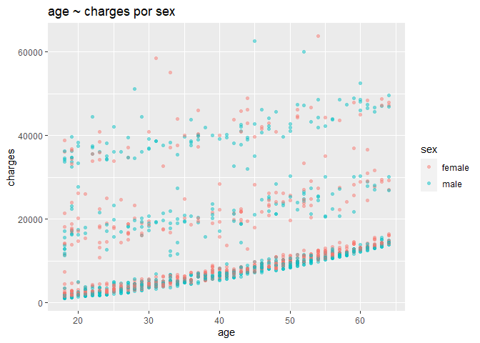<!-- -->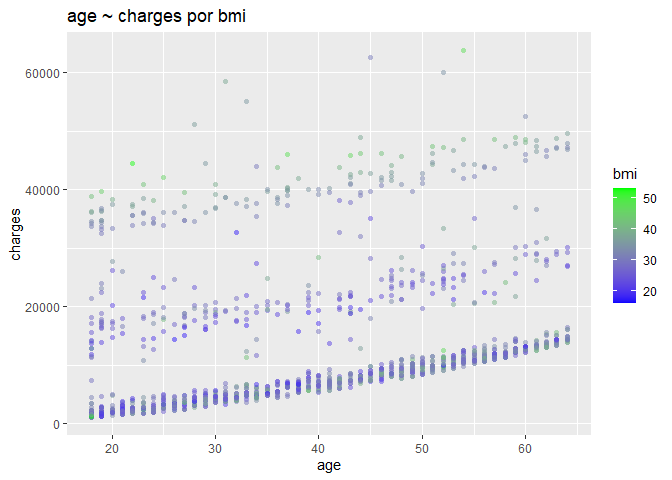<!-- -->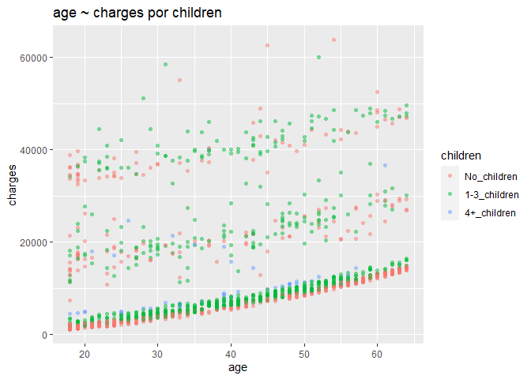<!-- -->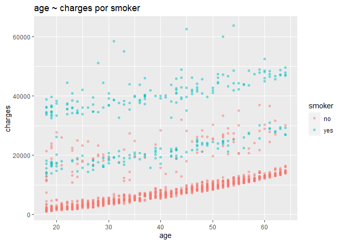<!-- -->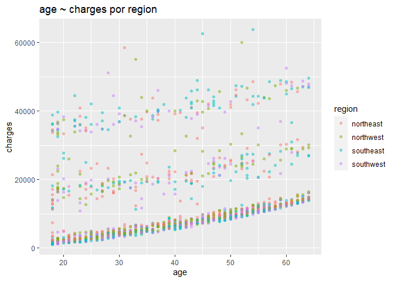<!-- -->

Muy llamativa la gráfica en función de si es fumador o no. Nos explica
gran parte de la variabilidad que antes no teníamos explicada: la nube
de puntos más abajo en el eje y corresponde en gran parte a no fumadores
(colores rojos), la nube en la parte superior corresponde a los no
fumadores, y en la banda intermedia tenemos una mezcla. Vamos a ver si
somos capaces de explicar esta variabilidad en la zona intermedia a
través de alguna de las otras variables restantes.

bmi parece una buena candidata en ese sentido. En el gráfico de bmi,
parece que en la nube inferior predominan los colores más azulados
(valor bajo bmi), en la nube intermedia predominan más los tonos
violetas y grisáceos (valor intermedio bmi) y en la nube superior
predominan los tonos grisáceos y verdosos (valor alto bmi).

Para estudiar con un poco más de claridad el comportamiento de bmi,
vamos a aislar el efecto de la variable smoker, y vamos a volver a
representar el gráfico.

``` r
ggplot(df) +
geom_point(aes(x = age, y = charges, colour=bmi), alpha=0.5, shape=16) +
scale_color_gradient(low="blue", high="green") +
facet_wrap(~smoker)
```

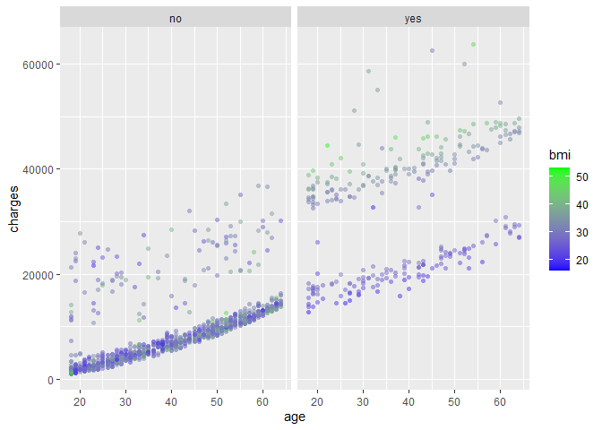<!-- -->

Se ve con un poco más de claridad lo que se apuntaba anteriormente: para
una misma franja de edad, cuanto más subimos en el eje y (charges), más
cambia el color del punto en el sentido creciente (azul-&gt;verde) en la
escala bmi. Esto apunta a que hay una relación directa entre ambas
variables.

Lo que queda un poco sin explicar, es ese patrón de división en nubes de
puntos que vemos en los gráficos anteriores. Si la relación de bmi con
age y charges fuese lineal, el cambio de color sería progresivo y sin
espacios en el medio, no tendríamos ese salto entre ambas nubes con un
espacio en blanco.

-   bmi:

Aunque ya hemos estudiando bastante esta variable en conjunción con
otra, hacemos un estudio por separado. Del scatter plot contra la
variable target, parece que hay una correlación lineal positiva no muy
fuerte.

``` r
# Lo confirmamos haciendo una regresión
regresion_bmi <- lm(charges ~ bmi, data=df)
summary(regresion_bmi)
```

    ## 
    ## Call:
    ## lm(formula = charges ~ bmi, data = df)
    ## 
    ## Residuals:
    ##    Min     1Q Median     3Q    Max 
    ## -20956  -8118  -3757   4722  49442 
    ## 
    ## Coefficients:
    ##             Estimate Std. Error t value Pr(>|t|)    
    ## (Intercept)  1192.94    1664.80   0.717    0.474    
    ## bmi           393.87      53.25   7.397 2.46e-13 ***
    ## ---
    ## Signif. codes:  0 '***' 0.001 '**' 0.01 '*' 0.05 '.' 0.1 ' ' 1
    ## 
    ## Residual standard error: 11870 on 1336 degrees of freedom
    ## Multiple R-squared:  0.03934,    Adjusted R-squared:  0.03862 
    ## F-statistic: 54.71 on 1 and 1336 DF,  p-value: 2.459e-13

``` r
# viene a confirmar las suposiciones hechas a la vista del scatterplot
```

Curioso cómo se distribuye la nube de puntos. Para aquellos con charges
inferiores a 17500 (que es gran parte de la muestra), la nube forma más
o menos un rectángulo. Para valores de bmi entre 22 y 30, vemos que hay
una nube de puntos que destaca con charges más altas de lo normal
(17500-30000 dólares). Y para valores de bmi superiores a 30, vemos otra
nube de puntos que destaca aún más, con charges entre 35000 y 50000
dólares.

Estas dos nubes que destacan, se corresponden a los fumadores?

``` r
ggplot(df) +
  geom_point(aes(x = bmi, y = charges), alpha=0.5, shape=16) +
  facet_wrap(~smoker)
```

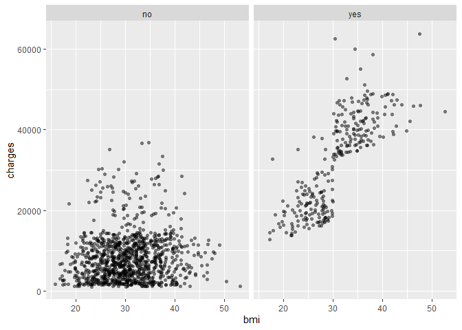<!-- -->

Gráfica muy llamativa. Parece que el comportamiento de bmi frente a
charges está bastante influenciado por otra variable independiente:
smoker. Para los no fumadores la relación no parece lineal. Mientras que
para los fumadores sí que se observa un comportamiento lineal, pero con
una singularidad. Hay heterocedasticidad en este subgrupo, no es una
relación lineal “al uso”. Parece más bien que se clasifican en dos
bloques, con punto de corte bmi en torno a 30. Dentro de cada bloque hay
una correlación lineal positiva.

Para la gráfica de no fumadores, vemos que hay ciertos individuos que
tienen unas charges bastante más elevadas que la mayoría de la
población. Vamos a ver si alguno del resto de factores nos ayuda a
explicar esto:

``` r
plot <- ggplot(df) +
  geom_point(aes(x = bmi, y = charges, colour=age), alpha=0.5, shape=16) +
  scale_color_gradient(low="blue", high="green") +
  facet_wrap(~smoker)
print(plot)
```

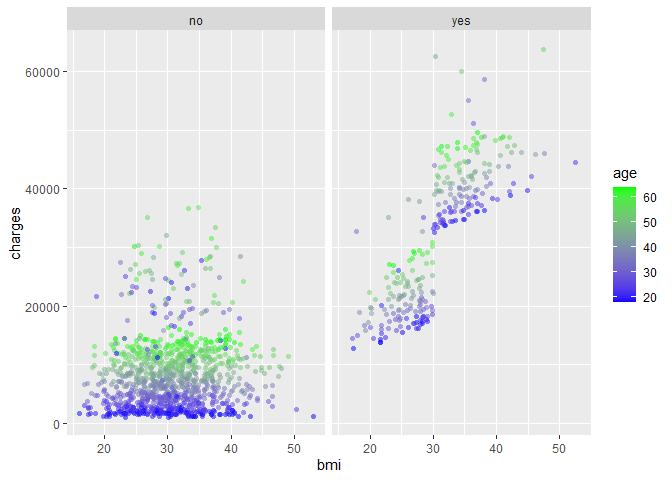<!-- -->

``` r
plot <- ggplot(df) +
  geom_point(aes(x = bmi, y = charges, colour=sex), alpha=0.5, shape=16) +
  facet_wrap(~smoker)
print(plot)
```

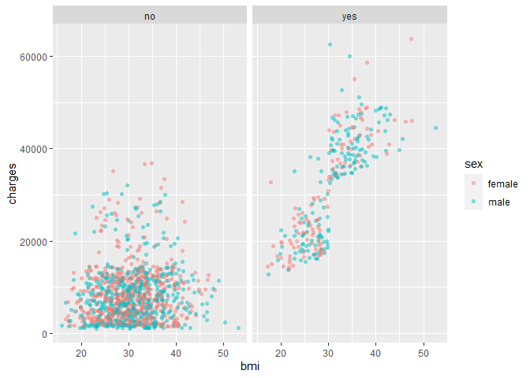<!-- -->

``` r
plot <- ggplot(df) +
  geom_point(aes(x = bmi, y = charges, colour=children), alpha=0.5, shape=16) +
  facet_wrap(~smoker)
print(plot)
```

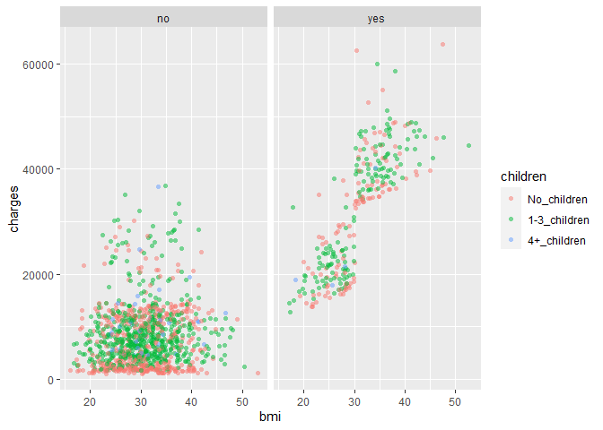<!-- -->

``` r
plot <- ggplot(df) +
  geom_point(aes(x = bmi, y = charges, colour=region), alpha=0.5, shape=16) +
  facet_wrap(~smoker)
print(plot)
```

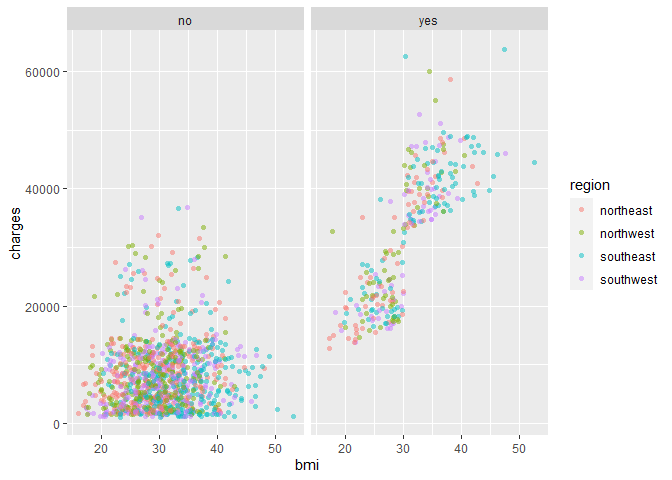<!-- -->

Salvo para age, que el gradiente de color revela la relación lineal que
ya habíamos descubierto, las otras 3 variables no nos esclarecen nada
(hice una prueba con los datos de children con sus valores numéricos
originales, y tampoco se veía relación).

A mi juicio, esto nos deja varias opciones: 1. la variable que explica
ese salto no está incluida en el los datos recogidos; 2. el salto se
explica con una combinación del resto de variables (children, region,
sex), no con una sola.

Rescatamos las primeras conclusiones (del análisis univariable, y las
unimos a las conclusiones obtenidas del análisis bivariable)

**Conclusiones EDA univariable**

-   Outliers en la variable target. Pueden tener una influencia excesiva
    en el tipo de modelo que usaremos
-   Cantidad de observaciones de menores de 20 años anómalamente alta.

**Conclusiones EDA bivariable**

-   Las variables sex, children y region no parecen tener ninguna
    relación de dependencia con la variable objetivo
-   Age, smoker y bmi sí parecen tenerla
    -   Hay una relación lineal con age, pero mucha de la variabilidad
        en la variable target queda sin explicar
    -   Buena parte de esa variabilidad no explicada, se explica con la
        variable smoker
    -   Con la variable bmi quizá expliquemos variabilidad, pero no
        sería una variabilidad del todo lineal, y además parece que hay
        dependencia entre smoker y bmi
-   El dataset tiene una cantidad de observaciones relativamente
    pequeña. Hay que tener cuidado al manipular los datos porque cambios
    en unos pocos datos podrían afectar bastante a cómo se comporta el
    modelo.

## 3. Preprocesado de datos

Teniendo en cuenta las conclusiones recién expuestas, nos planteamos
hacer ciertos cambios en nuestros datos:

Como habíamos visto, teníamos un número de observaciones anómalamente
alto para los individuos de 18 y 19 años, y tras el análisis bivariable
no se ha visto que aporten ninguna información interesante. ¿Causas de
esta anomalía? Podría ser representativo de la realidad, que por alguna
razón se suscribiese un seguro de salud nada más cumplir los 18 años, y
pasados dos años se decida no continuar. O podría ser un error a la hora
de introducir los datos, o que hayan sido asignados menores de 18 años a
estas edades.

*Ante la duda, considero que lo mejor es no alterar los datos
originales.*

En las múltiples gráficas que hemos hecho se ve que hay varias
observaciones, en concreto aquellas que tienen charges &gt; 50000, que
se salen mucho del comportamiento que presentan el resto de
observaciones.

*En primera instancia vamos a incluirlos en el modelo, pero estaremos
atentos a la influencia que tienen.*

## 4. Modelado

Vamos a entrenar un modelo de regresión lineal con los factores que
hemos visto en el EDA que pueden ser relevantes.A continuación,
entrenaremos el modelo usando stepAIC. Finalmente, extraeremos
conclusiones.

### Modelo con los factores escogidos en el EDA

``` r
regresion_relevantes <- lm(charges ~ age + smoker + bmi, data=df)
summary(regresion_relevantes)
```

    ## 
    ## Call:
    ## lm(formula = charges ~ age + smoker + bmi, data = df)
    ## 
    ## Residuals:
    ##      Min       1Q   Median       3Q      Max 
    ## -12415.4  -2970.9   -980.5   1480.0  28971.8 
    ## 
    ## Coefficients:
    ##              Estimate Std. Error t value Pr(>|t|)    
    ## (Intercept) -11676.83     937.57  -12.45   <2e-16 ***
    ## age            259.55      11.93   21.75   <2e-16 ***
    ## smokeryes    23823.68     412.87   57.70   <2e-16 ***
    ## bmi            322.62      27.49   11.74   <2e-16 ***
    ## ---
    ## Signif. codes:  0 '***' 0.001 '**' 0.01 '*' 0.05 '.' 0.1 ' ' 1
    ## 
    ## Residual standard error: 6092 on 1334 degrees of freedom
    ## Multiple R-squared:  0.7475, Adjusted R-squared:  0.7469 
    ## F-statistic:  1316 on 3 and 1334 DF,  p-value: < 2.2e-16

Todos los parámetros son estadísticamente significativos, y el r^2 es de
0.75. Vamos a comprobar cómo está ajustando nuestro modelo:

``` r
prediccion <- regresion_relevantes$fitted.values
residuos   <- regresion_relevantes$residuals
cook<-cooks.distance(regresion_relevantes)
```

``` r
plot(regresion_relevantes)
```

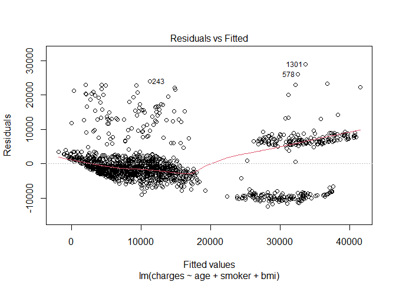<!-- -->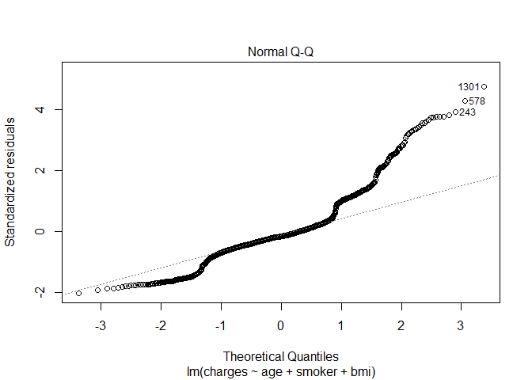<!-- --><!-- -->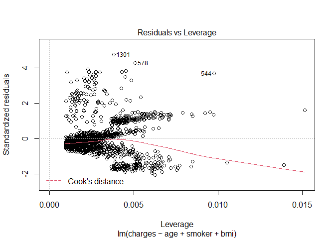<!-- -->

``` r
plot(prediccion)
```

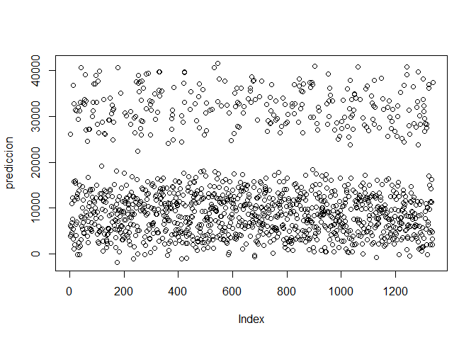<!-- -->

``` r
hist(residuos)
```

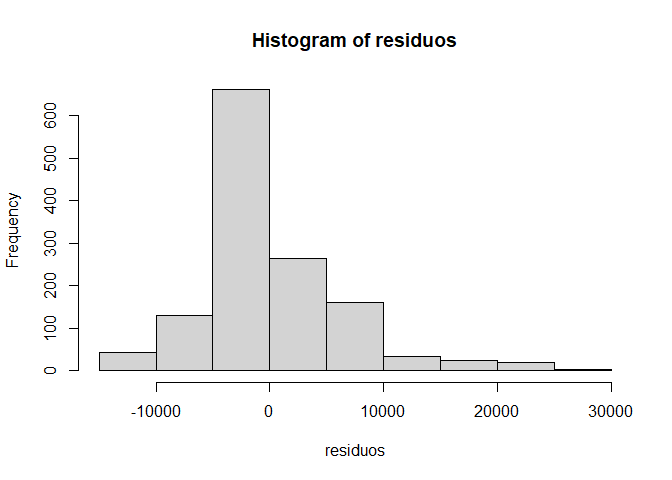<!-- -->

``` r
plot(cook)
```

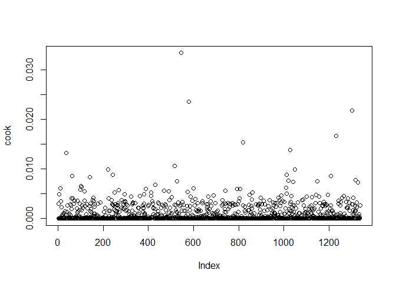<!-- -->

### Modelado con stepAIC

``` r
fit1 <- lm(charges~., data=df)
fit0 <- lm(charges~1, data=df)
```

``` r
regresion_step <- stepAIC(fit0,direction="both",scope=list(upper=fit1,lower=fit0))
```

    ## Start:  AIC=25160.18
    ## charges ~ 1
    ## 
    ##            Df  Sum of Sq        RSS   AIC
    ## + smoker    1 1.2152e+11 7.4554e+10 23868
    ## + age       1 1.7530e+10 1.7854e+11 25037
    ## + bmi       1 7.7134e+09 1.8836e+11 25109
    ## + children  2 1.0467e+09 1.9503e+11 25157
    ## + region    3 1.3008e+09 1.9477e+11 25157
    ## + sex       1 6.4359e+08 1.9543e+11 25158
    ## <none>                   1.9607e+11 25160
    ## 
    ## Step:  AIC=23868.38
    ## charges ~ smoker
    ## 
    ##            Df  Sum of Sq        RSS   AIC
    ## + age       1 1.9928e+10 5.4626e+10 23454
    ## + bmi       1 7.4856e+09 6.7069e+10 23729
    ## + children  2 6.5423e+08 7.3900e+10 23861
    ## <none>                   7.4554e+10 23868
    ## + sex       1 1.4213e+06 7.4553e+10 23870
    ## + region    3 1.0752e+08 7.4447e+10 23873
    ## - smoker    1 1.2152e+11 1.9607e+11 25160
    ## 
    ## Step:  AIC=23454.24
    ## charges ~ smoker + age
    ## 
    ##            Df  Sum of Sq        RSS   AIC
    ## + bmi       1 5.1129e+09 4.9513e+10 23325
    ## + children  2 4.0744e+08 5.4219e+10 23448
    ## <none>                   5.4626e+10 23454
    ## + sex       1 2.2255e+06 5.4624e+10 23456
    ## + region    3 1.3843e+08 5.4488e+10 23457
    ## - age       1 1.9928e+10 7.4554e+10 23868
    ## - smoker    1 1.2392e+11 1.7854e+11 25037
    ## 
    ## Step:  AIC=23324.76
    ## charges ~ smoker + age + bmi
    ## 
    ##            Df  Sum of Sq        RSS   AIC
    ## + children  2 3.7849e+08 4.9135e+10 23319
    ## + region    3 2.3201e+08 4.9281e+10 23325
    ## <none>                   4.9513e+10 23325
    ## + sex       1 3.9429e+06 4.9509e+10 23327
    ## - bmi       1 5.1129e+09 5.4626e+10 23454
    ## - age       1 1.7556e+10 6.7069e+10 23729
    ## - smoker    1 1.2358e+11 1.7310e+11 24997
    ## 
    ## Step:  AIC=23318.49
    ## charges ~ smoker + age + bmi + children
    ## 
    ##            Df  Sum of Sq        RSS   AIC
    ## + region    3 2.4193e+08 4.8893e+10 23318
    ## <none>                   4.9135e+10 23319
    ## + sex       1 5.8019e+06 4.9129e+10 23320
    ## - children  2 3.7849e+08 4.9513e+10 23325
    ## - bmi       1 5.0839e+09 5.4219e+10 23448
    ## - age       1 1.7346e+10 6.6481e+10 23721
    ## - smoker    1 1.2337e+11 1.7250e+11 24997
    ## 
    ## Step:  AIC=23317.88
    ## charges ~ smoker + age + bmi + children + region
    ## 
    ##            Df  Sum of Sq        RSS   AIC
    ## <none>                   4.8893e+10 23318
    ## - region    3 2.4193e+08 4.9135e+10 23319
    ## + sex       1 6.0829e+06 4.8887e+10 23320
    ## - children  2 3.8841e+08 4.9281e+10 23325
    ## - bmi       1 5.1785e+09 5.4071e+10 23451
    ## - age       1 1.7197e+10 6.6090e+10 23719
    ## - smoker    1 1.2298e+11 1.7187e+11 24998

Vemos que el modelo ha escogido, en primer lugar, las 3 variables que
habíamos determinado tras el EDA, en primer lugar escoge smoker (era de
esperar, es la variable que muestra una relación más clara), luego age y
luego bmi. También considera relevantes para el modelo children y region
(si bien el impacto que tienen en la bajada el AIC es bastante menor al
de las otras tres variables). sex se queda fuera.

``` r
summary(regresion_step)
```

    ## 
    ## Call:
    ## lm(formula = charges ~ smoker + age + bmi + children + region, 
    ##     data = df)
    ## 
    ## Residuals:
    ##      Min       1Q   Median       3Q      Max 
    ## -11493.4  -2838.3   -965.8   1447.3  29977.4 
    ## 
    ## Coefficients:
    ##                       Estimate Std. Error t value Pr(>|t|)    
    ## (Intercept)          -12078.13     984.96 -12.263  < 2e-16 ***
    ## smokeryes             23866.68     412.80  57.817  < 2e-16 ***
    ## age                     257.49      11.91  21.620  < 2e-16 ***
    ## bmi                     339.12      28.58  11.864  < 2e-16 ***
    ## children1-3_children    925.95     340.06   2.723  0.00656 ** 
    ## children4+_children    2179.54     961.06   2.268  0.02350 *  
    ## regionnorthwest        -335.52     476.75  -0.704  0.48171    
    ## regionsoutheast       -1055.82     478.99  -2.204  0.02768 *  
    ## regionsouthwest        -960.16     478.28  -2.008  0.04490 *  
    ## ---
    ## Signif. codes:  0 '***' 0.001 '**' 0.01 '*' 0.05 '.' 0.1 ' ' 1
    ## 
    ## Residual standard error: 6065 on 1329 degrees of freedom
    ## Multiple R-squared:  0.7506, Adjusted R-squared:  0.7491 
    ## F-statistic: 500.1 on 8 and 1329 DF,  p-value: < 2.2e-16

R^2 ligerísimamente superior al modelo con las variables seleccionadas
en el EDA, si bien estamos añadiendo variables (complejidad para el
modelo) que casi no ayudan a explicar más variabilidad. El p-valor para
una de las regiones (northwest) indica que no se puede rechazar la
hipótesis nula de que su coeficiente sea 0.

``` r
prediccion <- regresion_step$fitted.values
residuos   <- regresion_step$residuals
cook<-cooks.distance(regresion_step)
```

``` r
plot(regresion_step)
```

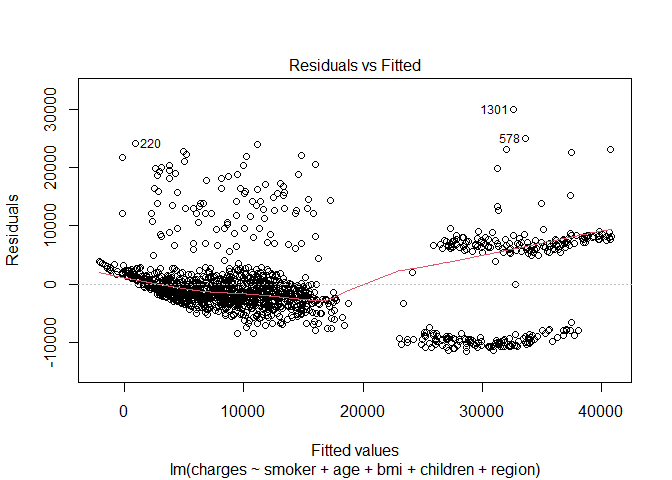<!-- -->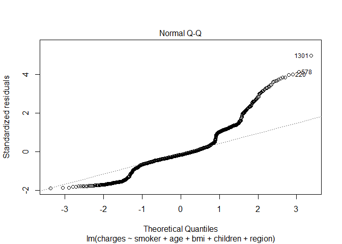<!-- -->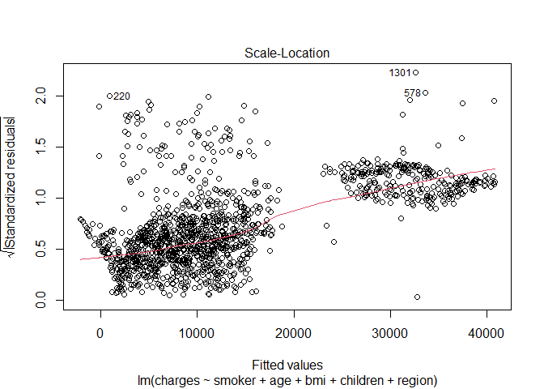<!-- -->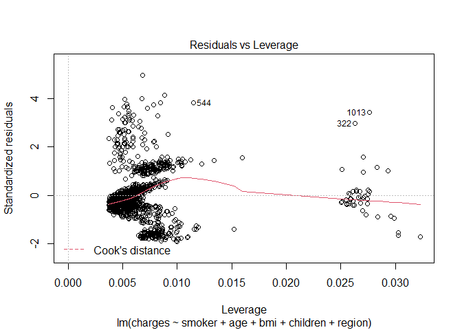<!-- -->

``` r
plot(prediccion)
```

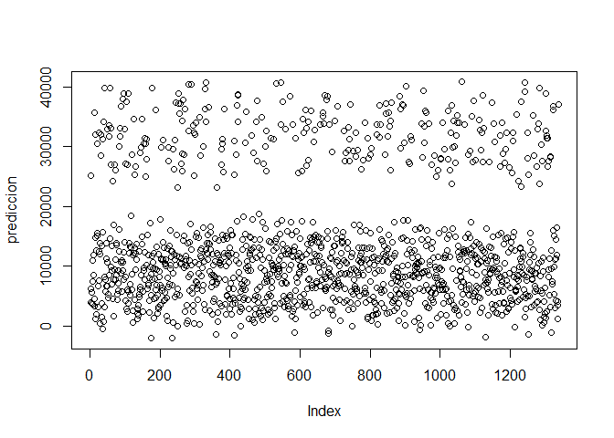<!-- -->

``` r
hist(residuos)
```

<!-- -->

``` r
plot(cook)
```

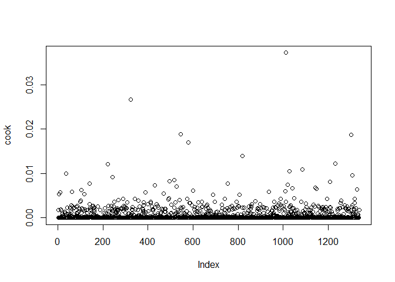<!-- -->

Vemos que los resultados del modelado con las variables adicionales, son
muy similares al modelado sin dichas variables.

Vamos a fijarnos en la primera gráfica, residuals vs fitted.

Y ahora vamos a fijarnos en la nube de puntos que destaca arriba a la
izquierda (residuos positivos, es decir el valor real bastante por
encima del predicho). Parece que se corresponde bastante bien con la
nube que habíamos visto en el plot de bmi vs charges para no fumadores.
El modelo no consigue explicar esos valores.

Respecto a los valores más a la derecha del gráfico, vemos que hay dos
subgrupos claros: para un grupo el modelo predice charges excesivas,
para el otro grupo se queda corto. Se corresponde bastante con las
observaciones que apuntamos en el EDA de no linealidad y división en
bloques, cuando estudiamos las interrelaciones entre charges, bmi y
smoker.

Ningún outlier tiene una distancia de Cook superior a 1. Se podrían
hacer más pruebas tratando los outliers, pero parece que está claro que
ese no es el principal problema en este modelo, así que no lo vamos a
hacer.

Otra cosa con la que hay que tener cuidado con este modelo, es en los
valores más bajos…

``` r
hist(regresion_relevantes$fitted.values, 
     border = "blue", 
     col = "tomato", 
     las = 1, 
     main = "Histograma de charges predichas",
     xlab  = "charges")
```

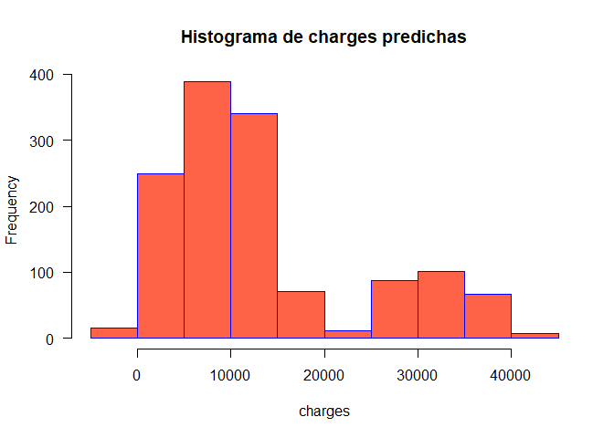<!-- --> Si lo
comparamos con el histograma de charges reales, vemos que en el grupo de
(0,5000) el modelo lineal que hemos utilizado mete a mucha menos gente
de la que hay en la realidad. Estaríamos siendo injustos con esa porción
de la población. Y para algunas personas predice unas charges negativas.

Solucionando los problemas que apuntamos anteriormente, ayudaríamos a
mitigar esta distorsión.

## 5. Conclusiones finales

Hemos encontrado un modelo con r^2 alrededor de 0.75. Los factores más
relevantes son smoker, age y bmi.

En cuanto a la variabilidad no explicada, son interesantes los gráficos
que hemos visto en el EDA, y la distribución de los residuals vs fitted
en el modelo. A la vista de los análisis realizados se pueden establecer
una serie de hipótesis que podrían servir como punto de partida para
profundizar en este estudio, y conseguir mejorar el modelo:

-   Intentar encontrar un patrón para las desviaciones en el subgrupo de
    no fumadores, ya sea con una combinación de las variables que
    disponemos, o ampliando el estudio a más variables
-   Explorar otros modelados (de esto aún no he visto mucho, sólo el
    principio del módulo 6). Quizá una combinación de modelos de
    regresión lineal, apoyados en reglas de decisión podría funcionar
    bien (hemos visto que para fumadores, con un determinado rango de
    bmi, hay grupos bien diferenciados).
